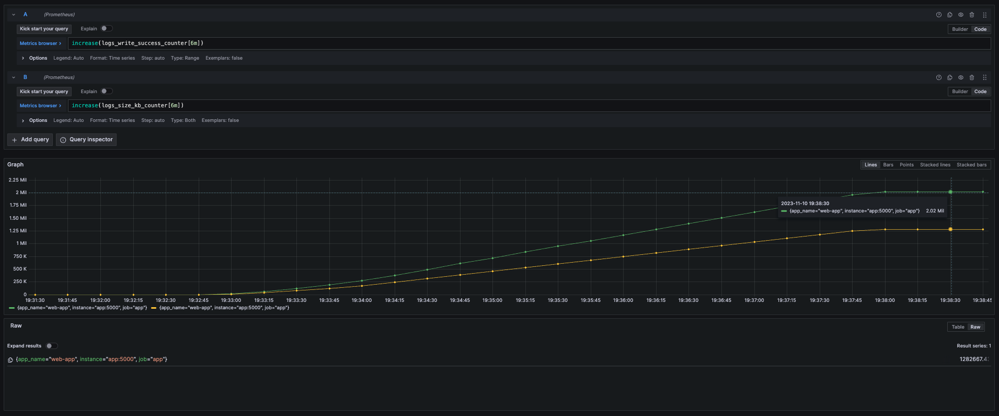

# LoadTest

If you create containers from sample WebApi you can try to test load on loki.

Install [k6](https://k6.io/docs/get-started/installation/) on your PC and in terminal run `k6 run query_load.js` 

In the current example 10 000 virtual users were created and a load 
of 10 000 RPS was given for 5 minutes to the service that has `RequestResponseLoggingMiddleware`.

Service generate about 2 million logs(1.3 Gb) during 5 minutes.