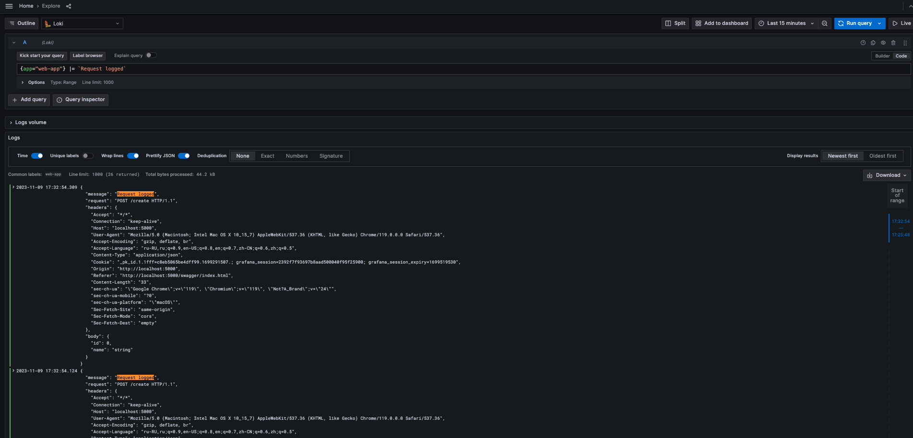
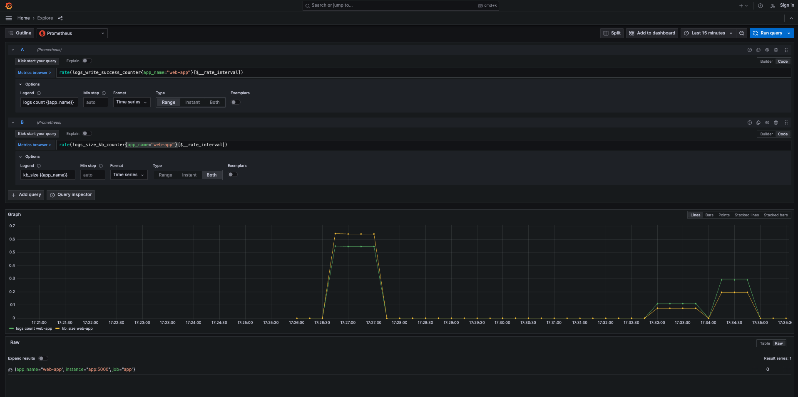

# Running samples

## WebApi

Only two commands:
```
docker network create loki
docker-compose up --build -d
```

After all containers are running you should add new Prometheus DataSource in Grafana with connection address `http://prometheus:9090`

## ConsoleApp

You only need running `loki` and `grafana` containers. Then run consoleApp.



